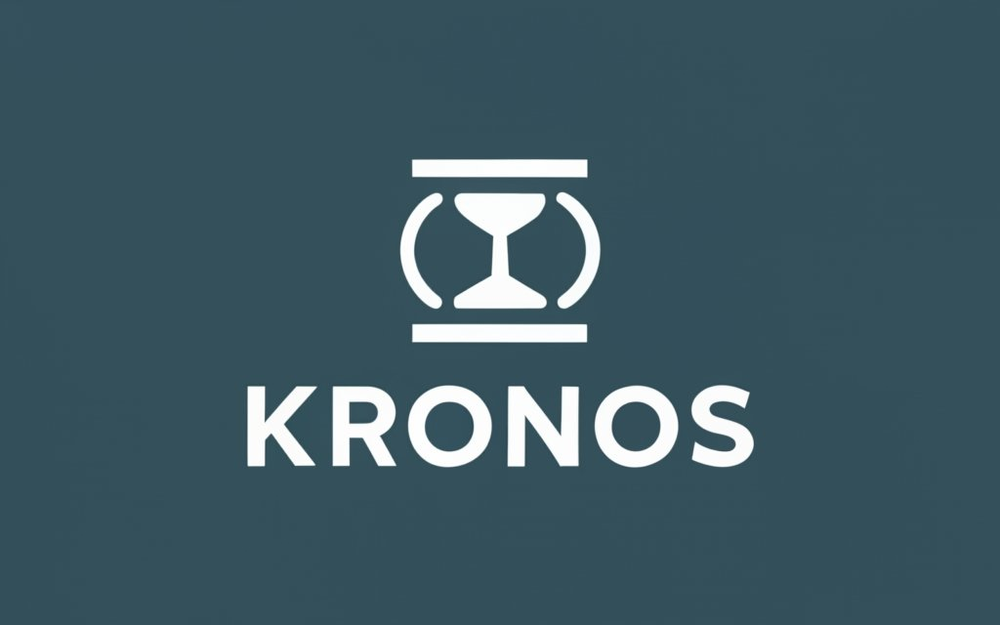

*Python integration with Xautomata API*

# Kronos
Classe per la gestione dei timestamp in modo chiaro e univoco. La classe forza l'uso delle timezone indipendentemente da come
si crea l'oggetto temporale.

Kronos è basata unicamente su librerie standard di python datetime, math e pytz.

Un oggetto Kronos è interamente compatibile con un oggetto datetime.

# utilizzo

## date

### creazione
il metodo **primetime** permette di creare un elemento temporale Kronos
```python
import Kronos
Kronos.primetime(year=2023, month=4)
>> 2023-04-01 00:00:00+02:00
```
**primetime** ha come campo obligatorio l'anno, i restanti valori vengono messi all'inizio del range temporale non assegnato.
Se non definita, di default viene impostata la timezone di Roma.

``Kronos.now()`` e ``Kronos.today()`` restituiscono l'oggetto Kronos rispettivamente con il momento corrente o il giorno corrente (il giorno è privo di time zone non avendo le ore).

### conversione
E' possibile passare da datetime a Kronos e viceversa con semplici passaggi
```python
import Kronos
from datetime import datetime
now_k = Kronos.from_datetime(datetime.now())  # da datetime a kronos
now_dt1 = Kronos.now().dt  # da Kronos a datetime estraendo l'attributo
now_dt2 = Kronos.now().datetime()  # da Kronos a datetime con funzione di estrazione
```

E' altrettanto semplice caricare convertire un isoformat in un oggetto kronos ``Kronos.from_iso('2023-01-01T00:00:00')``.

Un elemento Kronos è poi facilmente convertibile in un formato isoformat in piu di una maniera:
```python
import Kronos
now_iso1 = Kronos.now().iso()  # da Kronos a isoformat
now_iso2 = Kronos.now().isoformat()  # da Kronos a isoformat (identica alla precedente)
now_iso3 = Kronos.now().dt.isoformat()  # da Kronos a datetime a isoformat()
```

In tutte queste situazioni, se la time zone è assente, viene sempre automaticamente aggiunta.

Se si carica un elemento **date** questo verra convertito in un **datetime** e abbianto ad una timezone.

### costruttori
- now
- today
- primetime
- from_isoformat
- from_iso
- from_timestamp
- from_ts
- from_datetime
- from_dt
- from_format
- from_list_iso_to_datetime
- from_list_iso
- from_timedelta
- from_td

### funzioni
Esistono una serie di operazioni applicabili agli oggetti Kronos:
- start_of
- end_of
- add_duration
- subtract_duration
- ==, >, >=, <, <=, -
- date, datetime, isoformat, iso, timestamp, ts

Le operazioni ==, >, >=, <, <=, - permettono di confrontare date cross classi, permettendo di comparare stringhe in isoformat e datetime con Kronos, di seguito un esempio.
```python
import Kronos
from datetime import date, datetime
Kronos.now() > Kronos.from_iso("2022-01-01")
>>> True
Kronos.now() > datetime.fromisoformat("2022-01-01")
>>> True
Kronos.now() > date.fromisoformat("2022-01-01")
>>> True
Kronos.now() > "2022-01-01"
>>> True
```

### start_of, end_of
Permettono di muovere il cursore temporale all'inizio o alla fine di una finestra scelta.
E' possibile sceglire di trasformare una data nell'inizio della giornata o nella fine della settimana, rispetto alla data selezionata.
```python
import Kronos
day = Kronos.now().start_of_day()  # ottengo l'inizio della giornata
month = Kronos.now().end_of_month()  # ottengo la fine del mese
```
I range temporale tra cui scegliere sono:
- minute
- hour
- day
- week
- month
- year

### add and subtract duration
Permette di aggiungere o togliere un certo ammontare di range temporale dalla data scelta.
```python
import Kronos
date = Kronos.from_iso('2023-01-01T00:00:00')  # converto un isoformat a Kronos
date.add_duration(days=3, minutes=7)  # aggiungo 3 giorni e 7 minuti
>> 2023-01-03 00:07:00+02:00
date.subtract_duration(years=1)  # tolgo 1 anno
>> 2022-01-01 00:00:00+02:00
```

### concatenazione
Tutte le operazioni applicabili su un elemento Kronos sono concatenabili
```python
import Kronos
date = Kronos.today().to_datetime().start_of_month().end_of_day()
```
Nell'esempio qui sopra viene presa la gioranta in formato date, viene convertita in datetime, viene preso l'inizio del mese e da li ci si sposta alla fine della giornata.

### intervallo temporale
esiste un metodo leggermente differente, che dato un Kronos, un intervallo tempora e un offset restituisce gli estremi del range temporale richiesto.
```python
import Kronos
start, stop = Kronos.from_iso('2023-01-01T00:00:00').from_interval(10, 10, 'days')
>> 2022-12-11 00:00:00, 2022-12-21 00:00:00
```

## differenze temporali
Gli elementi Kronos supportano operazione di somma e sottrazione, ma a differenza di datetime, un operazione matematica tra due elementi kronos produce sempre un elemento kronos.
La ragione di questa scelta è legata al minimizzare gli import per fare operazioni su oggetti temporale.
Chiaramente una volta che un oggetto Kronos ha subito una operazione di questo genere non potra piu supportare i metodi indicati sopra.
Nonostante cio' supporta metodi analoghi a quelli di timedelta e si comportano in modo similare agli altri metodi di Kronos.

### +/-
Le operazioni supportate sono somme e sottrazioni
```python
import Kronos
now = Kronos.now()
yesterday = now.subtract_duration(days=1)
diff = now - yesterday
>> 1 days
```
Sottraendo due elementi Kronos si ottiene un oggetto differenza analogo in tutto e per tutto a un timedelta

### conversione
E' possibile passare da timedelta a Kronos e viceversa con semplici passatti
```python
import Kronos
from datetime import timedelta
now_k = Kronos.from_timedelta(td=timedelta(days=1))  # da timedelta a kronos
now_td = (Kronos.now() - Kronos.now().subtract_duration(days=1)).td  # da Kronos a timedelta
```

### approssimazione
gli oggetti Kronos di differenze temporali possono essere trasformati in numeri interi rappresentati l'approssimazione piu vicina al range temporale chiesto tramite il metodo ``in_periods``.
```python
import Kronos
now = Kronos.now()
yesterday = now.subtract_duration(days=1)
diff = now - yesterday
diff.in_days()
>> 1
```
